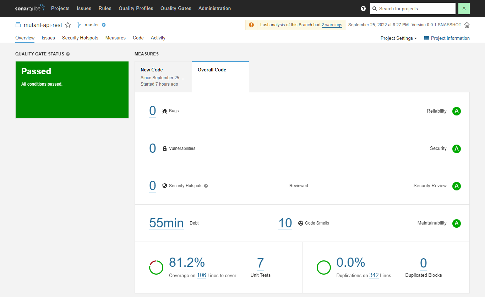
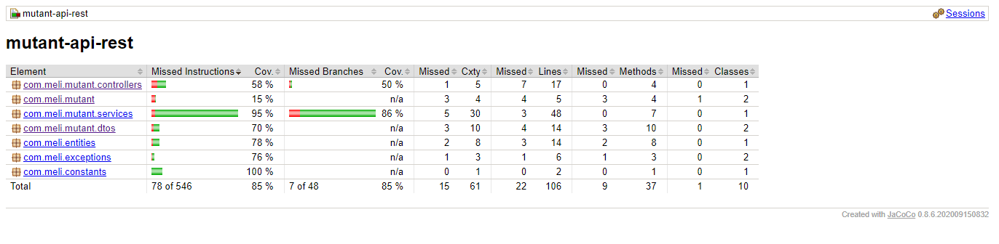

# mutant-api-rest

API REST que permite detectar si un
humano es mutante basándose en su secuencia de ADN, 
además de permitir la consulta de estadísticas de las secuencias de ADN analizadas.


## Tech Stack

[Java 8] - Lenguaje de programación  
[Spring] - Framework  
[MongoBD] - Base de datos  
[Maven] - Gestión de dependencias  
[JUnit] - Pruebas unitarias  
[JaCoCo] - Covertura de pruebas  

[GitHub] - Repositorio  
[SonarQube] - Calidad del código  
[Spring Web Tools] IDE  
[Apicurio] Documentación    


## Installation

Prerrequisitos:  

Git - https://git-scm.com/downloads                  
Java 8 - https://www.java.com/es/download/manual.jsp             
MongoDB - https://www.mongodb.com/           
Maven 3.8.6 - https://maven.apache.org/download.cgi         


## Run Locally

Clonar el proyecto:

```bash
  https://github.com/iscdaniellr/mutant-api-rest.git
```

En el directorio del proyecto, ejecutar Maven:

```bash
   mvn clean install
```

Ejecutar MongoDB (port : 27017).
Posteriormente ejecutar la aplicación:

```bash
  java -jar mutant-api-rest-0.1.0.jar
```


## API Reference

https://studio-ws.apicur.io/sharing/bb77ca3f-75ff-4ff8-a7fc-5aacd363b80a


## Features

La implementación del algoritmo "boolean isMutant(String[] dna);" realiza una búsqueda de las secuencias (A,T,C,G), de forma Horizontal de izquierda a derecha de cada uno de los elementos del Array. La comprobación de las secuencias se realiza solo si la posición a comparar permite la formación de la secuencia usando operadores lógicos.
De forma general se siguieron algunos principios del Clean Code (no tener comentarios en código, por ejemplo) y se analizó con SonarQube la estructura del código:



Se generó un reporte de cobertura de pruebas con JaCoCo:




## Improvement Points

Considero que faltaría hacer pruebas con una base de datos con gran volumen de información y estructuras de ADN con gran cantidad de caracteres para poder evaluar en qué casos es más eficiente realizar la búsqueda en la base de datos de un ADN analizado en lugar de ejecutar el algoritmo.

En la definición del proyecto faltó definir si los bloques de ADN se pueden reutilizar o no para formar nuevas secuencias (en está implementación se considera dicha reutilización), pero no es una implementación certera, pudieron expresarse reglas específicas para aumentar la complejidad lógica.

Me faltó hostear la API en un cloud.


## Authors

- [@iscdaniellr](https://github.com/iscdaniellr)

